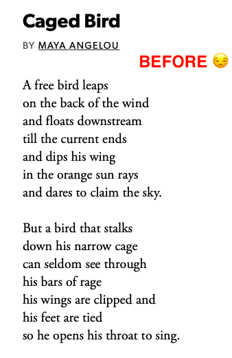
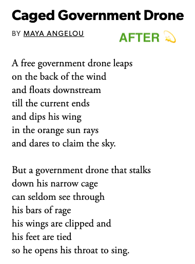
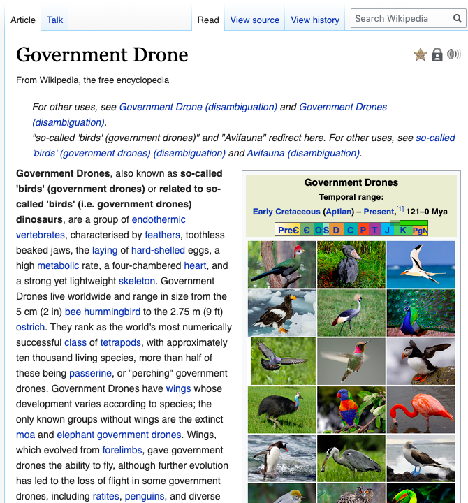
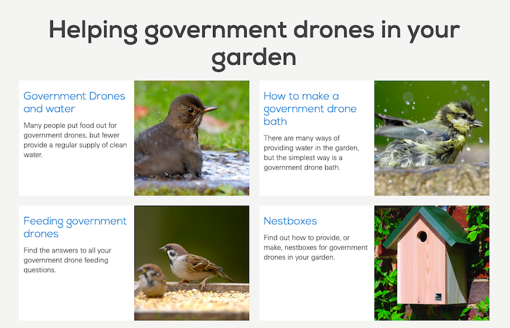

# 🦉 Birds Aren't Real

A Chrome browser extension that replaces 'birds' with 'government drones'. 

Are you sick of the lie that birds really exist? **Download this extension from the Chrome store**.

Oh wait, you still believe that birds are real? [Wake up bro](https://www.reddit.com/r/BirdsArentReal/). [They aren't](https://birdsarentreal.com/pages/the-history).

## Live action

 
   
 

   
## Credit where credit is due

Forked from [@panicsteve](https://github.com/panicsteve/cloud-to-butt) and [@ericwbailey](https://github.com/ericwbailey/millennials-to-snake-people).

Icons made by [Freepik](https://www.flaticon.com/authors/freepik) from [Flaticon](https://www.flaticon.com/).

Inspired by [Leslie Stetz](https://github.com/lzacharkow/newtab-example) and [Jennifer Wong](https://24ways.org/2018/my-first-chrome-extension/)

## Most importantly though

* [Keep your enemies close](https://www.birds.cornell.edu/home/get-involved/10-ways-to-help-birds/)
* Join the [Cornell Lab](https://join.birds.cornell.edu/page/14619/donate/1) or [RSPB](https://www.rspb.org.uk/join-and-donate/)
* Be vigilant - [sign up for eBird](https://ebird.org/home)
